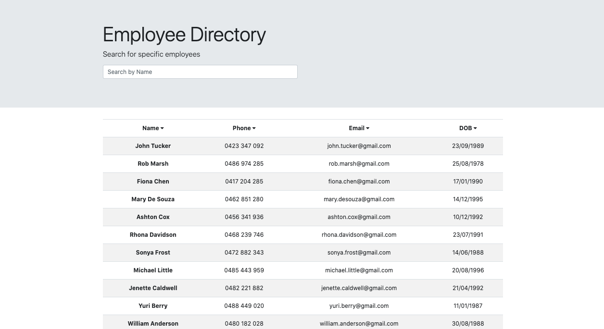

# Employee-Directory


## Description

An employee directory which allows users to search and sort through the list of employees. Built with React, it dynamically searches for the employees.

## Table of Contents

* [Installation](#installation)
* [Usage](#usage)
* [License](#license)
* [Questions](#questions)

## Installation

To install the necessary dependencies, run the following command:

```
npm i
```
Then run `npm start` to start the server.

## Usage



Open [http://localhost:3000](http://localhost:3000) to view it in the browser after installation.

Or click the following link to use the deployed version! <br />
https://acho9138.github.io/Employee-Directory/

## License

This project is licensed under the MIT license.

## Questions

If you have any questions about the repo, open an issue or want to discuss, contact me directly at anna.s.chong@gmail.com. You can find more of my work at [acho9138](https://github.com/acho9138/.).

## Credits

Thank you to the following resources to help make this app possible:

- The Coding Bootcamp at University of Sydney
- React App
- Bootstrap
- MDN
- Stack Overflow
- Node.js